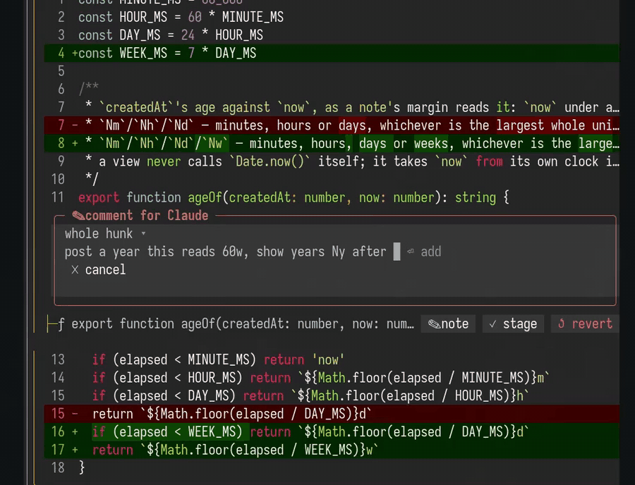

# Raven

A diff pane that sits next to Claude Code. Watch Claude's edits land, leave a note on the line you
mean, and Claude reads it on its next turn.



Claude finishes a turn with "I've updated the retry logic across the codebase", and you scroll up to
find out where. Then you describe the line you want changed in English ("the second change, the one
with the hours, no, the other one"). Raven is a side panel for that moment.

## What you get

- **A live diff.** Every changed file in one scrolling view, with syntax highlighting, updated as
  Claude edits files and runs commands. The file Claude is working on right now is highlighted.
- **Notes Claude reads.** Comment on a file, a hunk or a single line. Your notes go to Claude with
  your next prompt, or right away with **send**. After Claude replies, Raven marks the notes it
  addressed with ✓.
- **Stage and revert** a single hunk with a click.
- **Compare** against your last commit, the start of the session, the branch point, or one turn's
  edits.
- **Plans and docs, rendered.** Plans and specs show up formatted as Claude writes them, and Claude
  can show you any Markdown file on request. You can leave notes on their sections too.
- **Files and Tasks.** Your repository tree with changed files marked, and Claude's task list with
  its progress.
- **Reminders above the prompt.** Pending notes and updated plans show there while the pane is
  closed.

## Requirements

- Claude Code 2.1.287 or later
- A terminal at least 110 columns wide
- [Bun](https://bun.sh) installed (Claude uses it to run Raven's command-line helper; self-contained
  binaries that don't need Bun are coming soon)
- A [Nerd Font](https://www.nerdfonts.com) for the file icons (optional; without one, icons show as
  blank boxes)
- Under tmux, `CLAUDE_CODE_NO_FLICKER=1` set in your environment

## Install

In Claude Code:

```
/plugin marketplace add arunkumar9t2/raven
/plugin install raven@raven
```

Then run `/reload-plugins`, or restart Claude Code.

## Use

Type `/raven` to open the diff. Raven also opens on its own when Claude makes its first edit, writes
a plan, or starts a task list (see [Settings](#settings) to turn that off).

| Command | Does |
| --- | --- |
| `/raven` or `/raven diff` | opens the diff |
| `/raven doc` | opens the rendered plan or doc |
| `/raven files` | opens your repository tree |
| `/raven tasks` | opens Claude's task list |
| `/raven send` | sends your pending notes to Claude now |

Run a pane's command again to close it.

To leave a note, click **✎ note** on a file or a hunk, pick a line if you want one, type, and press
Enter. To send notes without waiting for your next prompt, click **send**.

You can also ask Claude to show you things, like "show me the plan in raven". To let Claude do that
without asking for permission each time, add `Bash(raven:*)` to the allowed tools in your settings.

## Settings

Open `/config` and look for Raven:

| Setting | Default | What it does |
| --- | --- | --- |
| `autoOpen` | on | Lets Raven open panes by itself: the diff on Claude's first edit, a plan as Claude writes it, the task list when Claude starts one. Turn it off and panes open only when you (or Claude, when you ask) open them. |
| `autoOpenColumns` | `144` | Raven only opens by itself when the terminal is at least this many columns wide. |
| `watchedPaths` | empty | Extra folders, comma-separated, whose Markdown files open rendered as Claude writes them. Plan folders are watched already. |
| `keyboardControls` | off | Draws plain buttons you can reach with Tab, so every control works from the keyboard. |

## Troubleshooting

- **The pane doesn't appear.** Widen the terminal to at least 110 columns; the pane draws as soon as
  it fits. Under tmux, set `CLAUDE_CODE_NO_FLICKER=1`.
- **Claude Code's own diff panel covers Raven.** Close it once with its ✕; Claude Code remembers.
- **Raven keeps opening by itself.** Turn off `autoOpen` in `/config`.
- **Icons look like boxes.** Switch your terminal to a Nerd Font.

## Contributing

Raven is a Claude Code plugin written in TypeScript. To work on it:

```bash
bun install
bun run setup:local    # load this checkout in every local Claude Code session (--remove to undo)
bun run check          # typecheck, lint, tests and plugin validation
```

`claude --plugin-dir ./plugins/raven` loads it for a single session instead. The design lives in
[`spec/`](./spec/README.md), and [`CLAUDE.md`](./CLAUDE.md) covers the layout and workflow.

## License

Apache License 2.0. See [LICENSE](./LICENSE).
