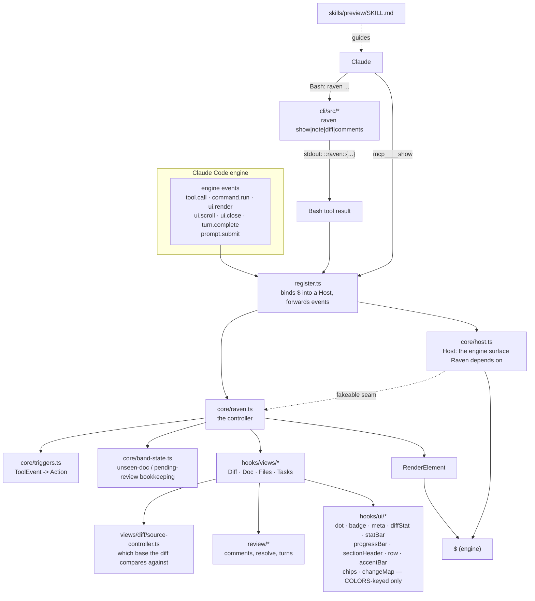
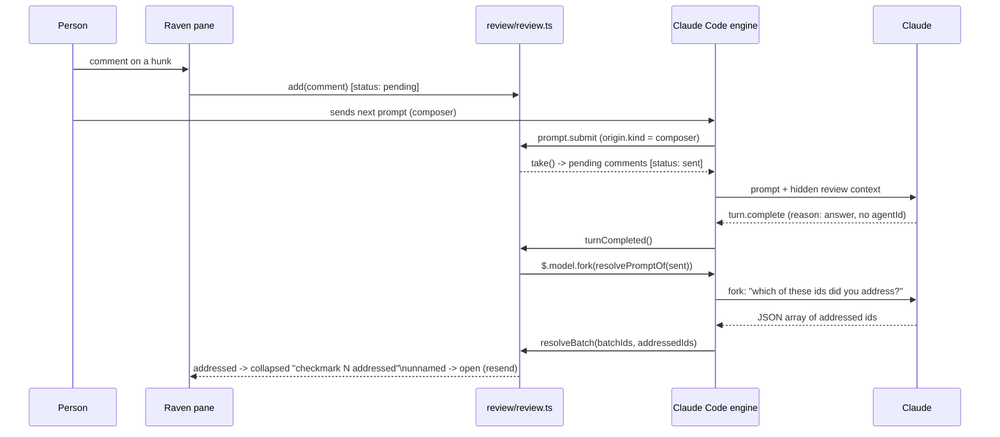

# Architecture

Raven exists because the transcript is the wrong place to watch a session's diff grow, read a plan
Claude just wrote, or leave a comment on a specific line of a hunk — a chat log, however well it
renders markdown, has no notion of a document that stays open and refreshes itself as the file
underneath it changes. Raven docks a pane beside the transcript that does have that notion: one
surface, several interchangeable views, kept current by reacting to the same engine events that
already fire on every edit, shell call and prompt.

## The three layers

Raven ships as one Claude Code plugin built from three layers that run in three different places and
own three different things.

| Layer | Lives in | Runs | Owns |
| --- | --- | --- | --- |
| **Mod** (deterministic) | `plugins/raven/hooks/` | inside Claude Code, as function hooks | every pixel, every reaction to an engine event, in-session state, prompt injection, the `show` tool |
| **CLI** (agentic fallback) | `plugins/raven/cli/` → `plugins/raven/bin/raven` | as a process Claude starts through Bash | argument parsing, path resolution against the shell's cwd, file validation, the directive it prints |
| **Skill** (agentic guidance) | `plugins/raven/skills/preview/` | in the model's context, on demand | when and how Claude should reach for the `show` tool, or the CLI when it is absent |

The mod is the only layer with a channel nothing outside the engine can call into: it runs in a
sandbox with no process, no inbound socket, no way for the model to hand it work except through
engine events the engine itself raises. Claude's primary way to reach it is the native
`mcp__<plugin>__show` tool the mod registers at `session.start` and answers directly — no process
between the model and the pane. The CLI exists for the two situations that tool can't cover: a human
at a shell, and a session running without function hooks, where no tool is there to call at all. It
never talks to the mod directly; it prints one **directive** line, and the mod reads that line back
out of the Bash tool's own result as that call returns. The skill is pure guidance — it tips the model
toward the tool when one is listed, and toward the CLI's exact invocations when it isn't — and holds
no state and calls nothing itself. [`agentic.md`](./agentic.md) owns the tool, the CLI and the
directive contract in full; this spec stops at naming what each layer is for.

## Component boundaries

`register.ts` binds `$` into a `Host` exactly once, at `session.start`, and stays thin from then on:
it matches engine events, unpacks the parts of `e` a handler needs, and calls into `core/raven.ts`'s
controller — it never draws anything or holds session state itself. `core/host.ts` declares that
`Host`: the narrow slice of `$` (`run`, `readFile`, `openPane`, `storeGet`/`storeSet`, `fork`,
`fillPrompt`, …) that everything below `register.ts` is written against, so a fake `Host` — not a
mocked `$` — is what makes the controller, the views and the pure git/review modules unit-testable
under `bun test` without the engine at all. `core/raven.ts` is the one thing `register.ts` calls into:
it owns which panes are open, debounced refreshes, the auto-open gate, and dispatches to whichever
view or subsystem an action names. `core/triggers.ts` is a pure function of a finished tool call to a
list of `Action`s (`refresh-diff`, `main-loop-edit`, `show-doc`, `reload-doc`, `directive`, `tasks`) —
adding a new reaction to a tool call is one function added to that registry, never a new case wired
into `register.ts` by hand. `core/band-state.ts` holds the small, separate piece of bookkeeping the
status band needs — what's pending, what's unseen — so the controller doesn't carry it inline. Each
view in `hooks/views/` (`diff-view.tsx`, `doc-view.tsx`, `tree-view.tsx`, `tasks-view.tsx`) owns one
pane's model and rendering and is handed a `Host`, never `$` directly, which is the same seam that
makes them testable in isolation. The diff pane alone delegates "what am I comparing against" to
`views/diff/source-controller.ts`, and "what did the person say about this hunk" to `review/*`.
Every view draws with the same small component kit in `hooks/ui/` — dots, badges, stat bars, the
change map, chips, the status band's and notes' accent bars — pure `(kit, props) =>
RenderElement` functions coloured only through `COLORS` theme keys, so one kit, not each view's
own styling, is what keeps the panes looking like one product.

## The Host and View contracts

A `View` (`core/view.ts`) is the unit the controller schedules: a `pane` (`id`, `title`), the
`/raven <subcommand>` that toggles it, a `render(kit)` that draws from the view's own model, and
optionally a `refresh()` the controller calls before a fresh module's first drawing of it and a
`scroll(by)` it can claim ownership of. A view never touches `$` and never imports from
`core/host.ts`'s implementation — only its type — which is what keeps a view testable with a fake
`Host` standing in for the engine. The `Host` itself is not "all of `$`": it is exactly the calls
something under `hooks/` actually makes, added to as new capability is needed, which keeps the seam
between deterministic logic and engine binding narrow enough to fake convincingly. `Kit` (`{ui,
columns, rows}`) is the other half of what a view's `render` takes — the element table for whatever
surface is drawing it plus the pane's own body dimensions — resolved lazily by `register.ts` so a
guard that declines to draw never pays for resolving it.

A **trigger** is a pure `(ToolEvent) => Action[]`; a **directive** is the shared shape (`op`, `path`,
`markdown`, `title`) the `show` tool's input and a CLI-printed line both parse into, via
`directiveOf` in `core/directive.ts` — one parser serves both entry points, so the tool and the CLI
can never drift on what a given `op` means. The **controller** (`core/raven.ts`) is the only module
that knows about all of these at once: it turns a finished tool call into actions via `triggersOf`,
runs each action (opening a view, running a directive, updating tasks), and is the one place a
directive's `runDirective` and the tool's `runTool` both funnel through.

## State ownership

Everything Raven remembers — pending review comments, the diff's chosen source (HEAD, session start,
branch point, a turn), which panes are open — lives in `$.store`, keyed by repository where it needs
to survive a session restart, and in the controller's own in-memory closures where it doesn't. None
of it lands in the working tree: a mod that wrote its own state into a file under the repository
would see that file appear in its own diff pane, which is the reason this rule exists rather than a
preference. `review/review.ts` and `views/diff/source-controller.ts` are the two places that persist
across sessions (`comments:<repository>`, `source:<repository>` store keys, from `hooks/names.ts`);
everything else the controller and views hold — which pane is open, the last-seen viewport width,
which docs have been shown — resets when the module does, deliberately, because none of it needs to
outlive one session's terminal.

## Naming

The product name is a working title, so every name derived from it — the slash command, pane ids,
the tool name, the directive line's prefix, `$.store` key prefixes, the compiled binary's name — comes
from one file, `plugins/raven/hooks/names.ts`, which the CLI imports at build time rather than
duplicating any of these strings. A rename is one edit to that file plus a rebuild, never a grep
across the mod and the CLI for a literal that drifted between them.

## Hot-reload adoption

A mod loaded from a live directory ([`mod-api.md`](./mod-api.md)'s "Hot reload") reloads when its sources change
mid-session, and the new module instance's closures start empty: it has no memory of which panes an
earlier instance opened, even though those panes are still on screen from the engine's point of view.
`core/raven.ts`'s `render` handles this by treating "I was asked to draw into this pane id" as proof
that the pane is open — adding it to its own bookkeeping and triggering that view's `refresh()` — the
first time a reloaded instance is asked to draw an id it doesn't remember opening, rather than trust
its own `open` set as ground truth after a reload. `core/band-state.ts`'s `isAnyPaneShown` makes the
same call by asking the engine directly (`$.ui.panes()`) instead of consulting the controller's set at
all, for the same reason.

## The review loop

The diff pane's comments exist to get a change reviewed without the person leaving the pane to type
in the transcript. A comment rides the next prompt as hidden context; once Claude's turn finishes,
Raven asks — via one more model turn, not by pattern-matching the reply — which of the comments it
sent got addressed.

Only the main loop's own turn (`e.agentId === undefined`) triggers a fork, and only one fork runs per
sent batch — a second batch sent while the first fork is still in flight is left untouched by that
fork's reply, resolved by its own later fork instead. [`review.md`](./review.md) owns the full comment
lifecycle (anchors, outdated groups, the send/edit-and-send/clear controls); this diagram is the shape
of the loop, not its every state.

## Where the other specs pick up

[`mod-api.md`](./mod-api.md) owns the engine's own contracts — events, UI element caps, panes, the
sandbox — that this spec's diagrams assume. [`agentic.md`](./agentic.md) owns the `show` tool, the CLI
and the directive contract in full. [`diff-pane.md`](./diff-pane.md) and [`review.md`](./review.md)
own the diff pane and its review tools in depth; [`views.md`](./views.md) owns the Doc, Files and
Tasks views plus the chrome shared across all four (status band, command row, pane tabs);
[`settings-and-surfaces.md`](./settings-and-surfaces.md) owns the `/config` fields and how a view
degrades on a surface missing an element; [`development.md`](./development.md) owns building, testing
and the closed-loop tmux harness.
